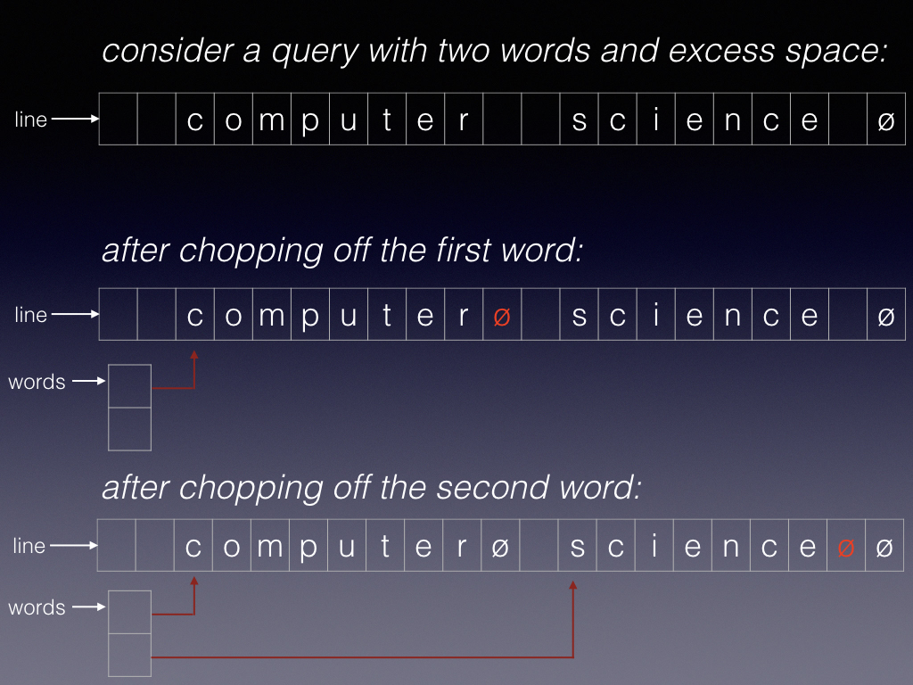

Here's a nice trick for breaking a single string `char* line` into an array of strings `char* words[]`.
In the example below, the query has two words, and there are leading spaces, separating spaces, and trailing space, terminated by a null.
Because in C a "string" is just a pointer to an array of characters terminated by a null `\0` character, we can chop this single string into multiple strings by replacing two of the spaces with nulls, and recording a pointer to the beginning of each word.
We don't need to allocate any memory for these new strings, or copy these strings - they stay right where they are.

## Related example

We saw an example of this concept when chopping up 'csv' (comma-separated values) data from the vaccine dataset, in the [covid example](https://github.com/CS50DartmouthFA25/examples/blob/main/covid/covid.c).
The details are different – that code knew exactly how many fields to expect, the words were separated by precisely one comma, and there was the added complexity of quoted fields.

In the query string, you don't know how many words to expect (but what is the maximum number of words in a string of length *n*?)

In the query string, you may need to slide past spaces and tabs at the front of the string, or over many spaces/tabs between words, as shown above.
So think about sliding two pointers along the array, starting at `line`.
One pointer might be `char* word` and you slide it over to the first non-space; the other pointer might be `char* rest` and you slide it from `word` to the first non-letter.
Squash that character `*rest` with a null, and you've created a null-terminated string starting at `word`.

*Think carefully* about the edge cases, as you construct the loops and slide the pointers.
